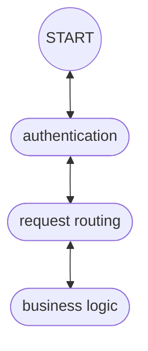

# Architecture

Request processing flow :

```mermaid
flowchart TD
    START@{shape: circle, label: START }
    AUTH@{shape: stadium, label: authentication}
    FIBER@{shape: stadium, label: request routing}
    BUSINESS@{shape: stadium, label: business logic}

    START <--> AUTH <--> FIBER <--> BUSINESS
```

Metadata are stored inside a [PostgreSQL](https://www.postgresql.org/) database.
